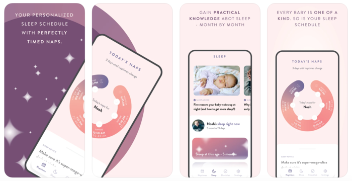

BabyNaps gives you a personalized sleep schedule for your baby. Enjoy perfectly timed naps throughout the day. Once you find your routine, your baby will sleep just the right amount during the day and well at night. Does that sound too good to be true? 8 of 10 parents confirm that they sleep better at night with BabyNaps. In the app, you also learn the skills and tools to improve your baby's sleep. The result? Brilliant days with more energy and freedom - and more time for you once your baby falls asleep at the right time each night.

**Project:** English UX writing for a Swedish app with a diverse audience. Localization focused.

**Medium**: Mobile app

**Audience**: Parents with babies (up to 18 months)

**Challenge**: Make a complex topic easily digestible for tired parents. Offer knowledge without overwhelming the audience.

**Tonality drivers**: Calming, clear, educating.

**Process:** App designs in Swedish > Create English copy > Create app description

