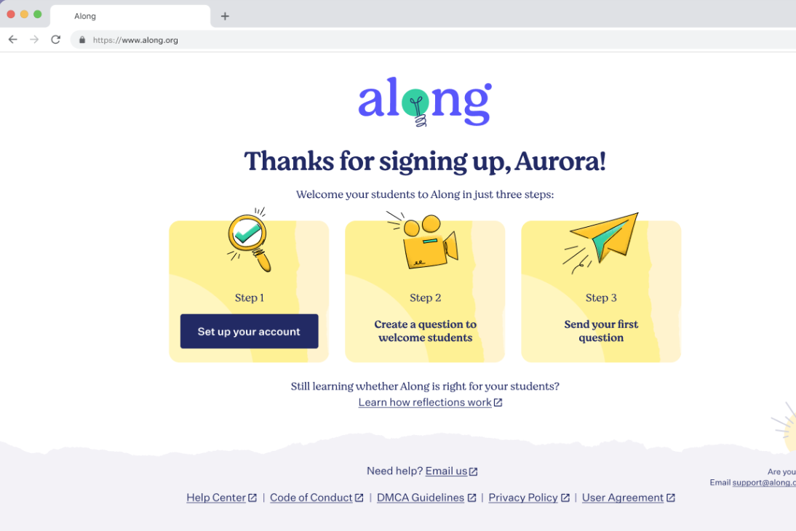
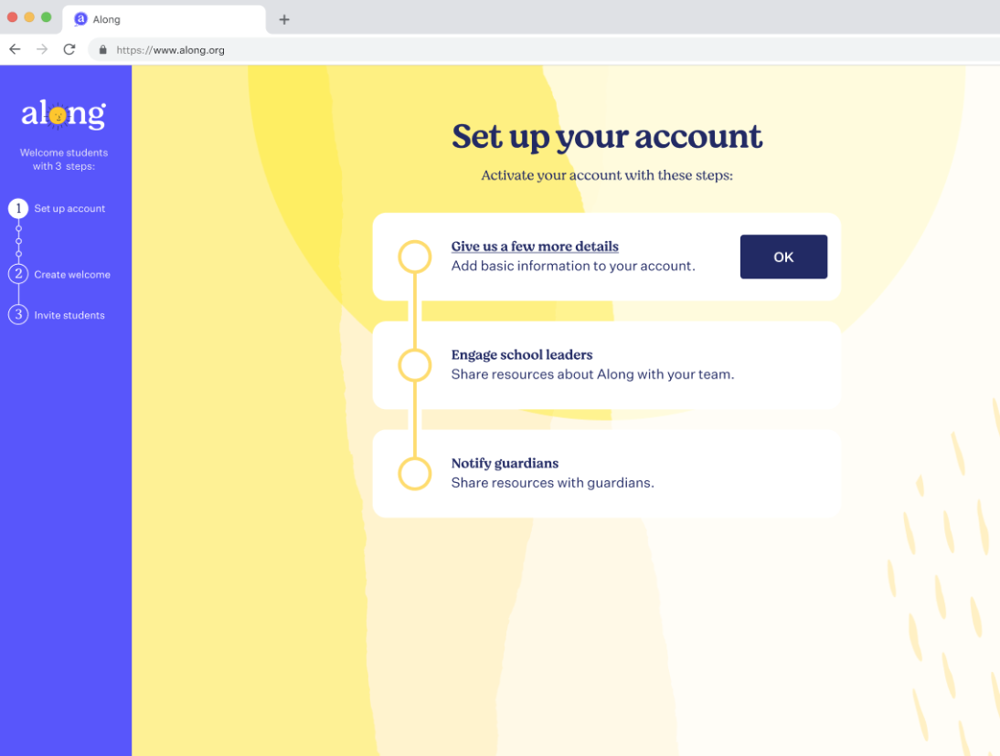
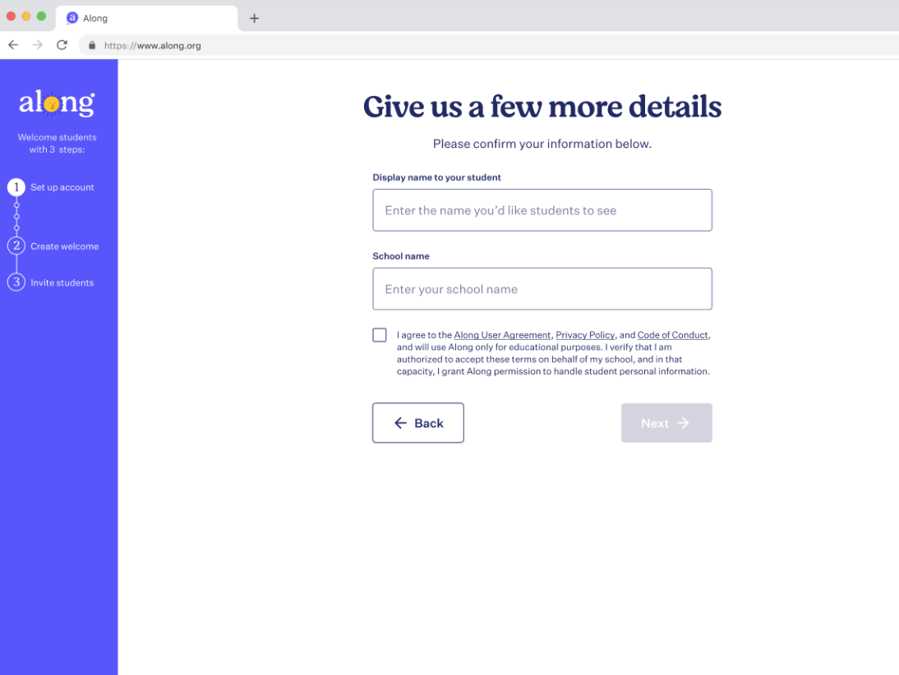
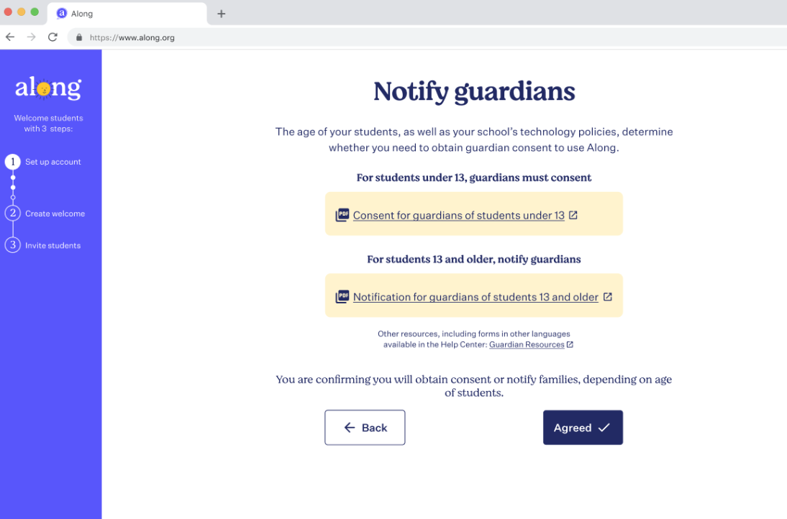
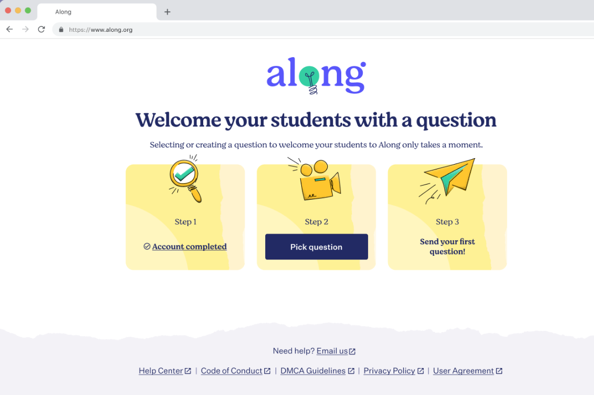
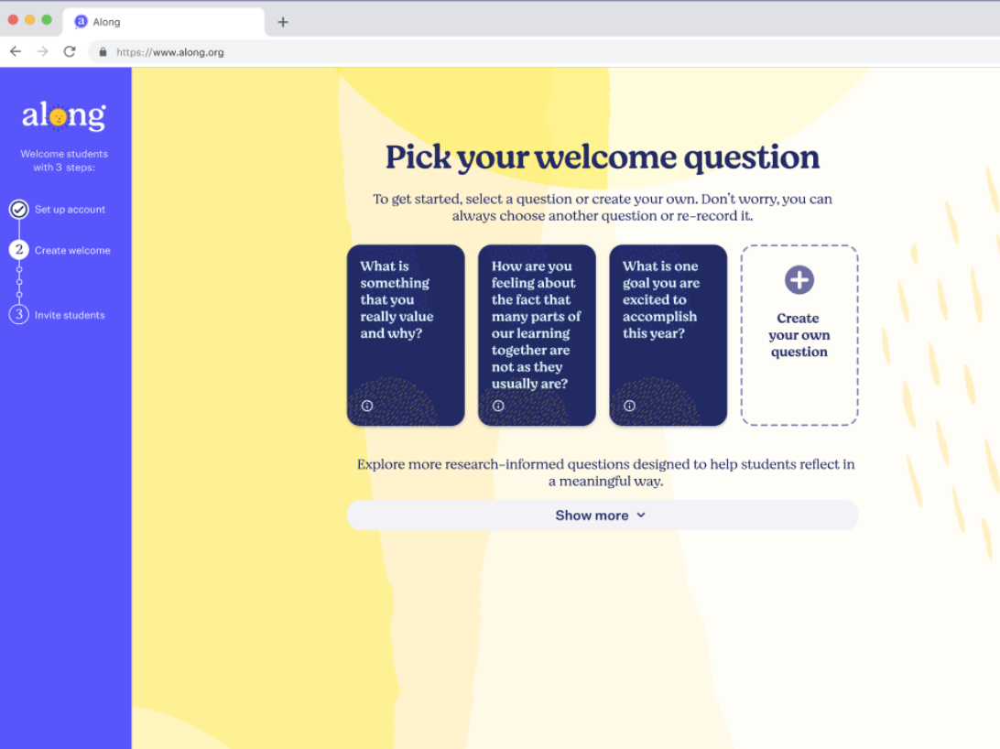
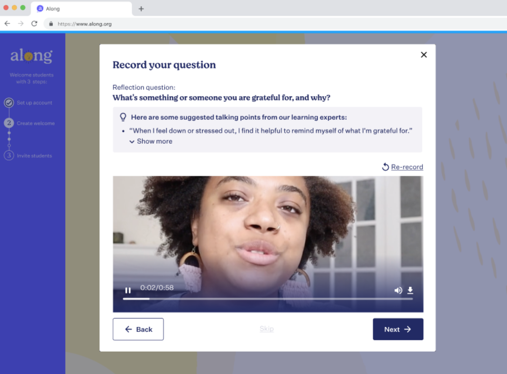
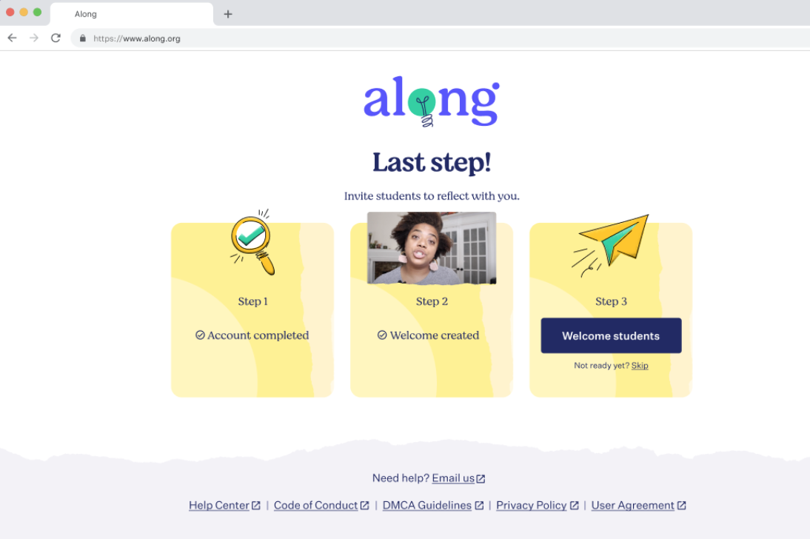
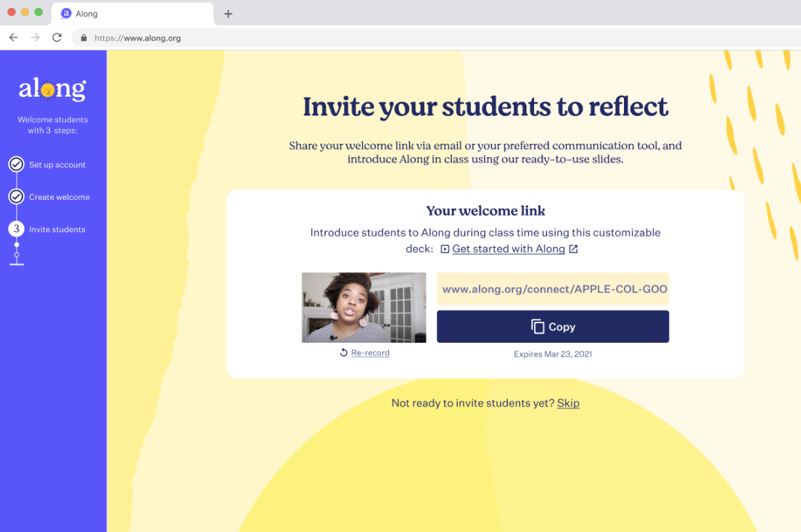
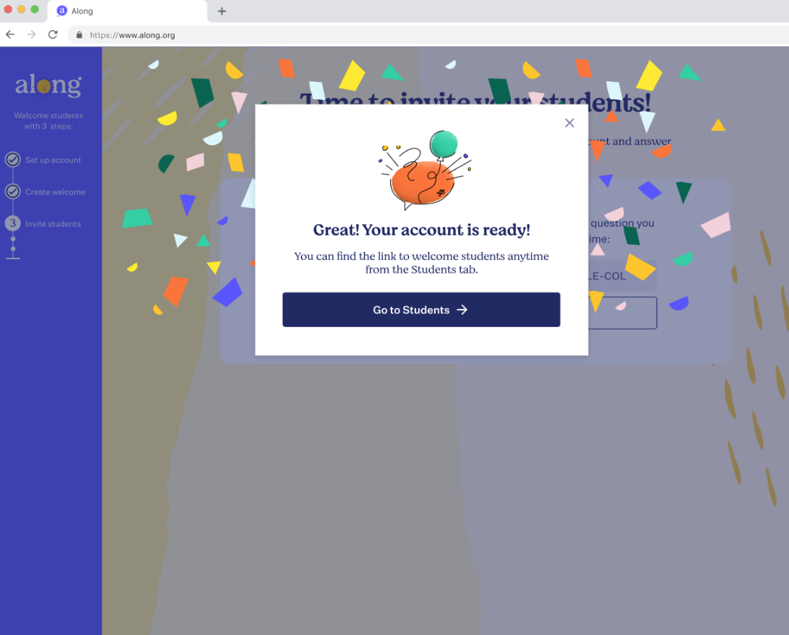

## Content Strategy and UX copy for Along

Along is a digital reflection tool that makes it easier for educators to check in one-on-one with each student. Along is part of the Chan Zuckerberg Initiative.

**My role:** Content Strategist and UX Writer

**Engagement length:** 14 months

**Scope:** I was the sole Content Strategist/UX Writer for Along and worked on the entire product and website. However, I will only be sharing the educator onboarding as an example here.

## Teacher onboarding experience for Along

**Audience:** Teachers (middle school)

**What?:** This is the onboarding flow for teachers that first sign up.

**Stakeholders:** Design team, Marketing team, PM, Teachers (via extensive User testing)

**Goal:** Launch V1

**Challenges:** How can we make onboarding as fast and easy as possible while also ensuring we keep up with legal constraints (such as informing guardians) and explaining core concepts such as how reflections work?

**Basic process:** Develop Tone and Voice > User research > Plan > Design/Copy > Prototype > Test > Design/Copy adjustments > Test > Copy adjustments

**Tools:** Figma

**Medium:** Web app, Website, Resources, Presentations, Messaging

**Outcome**: Increased onboarding completion by 26%.

