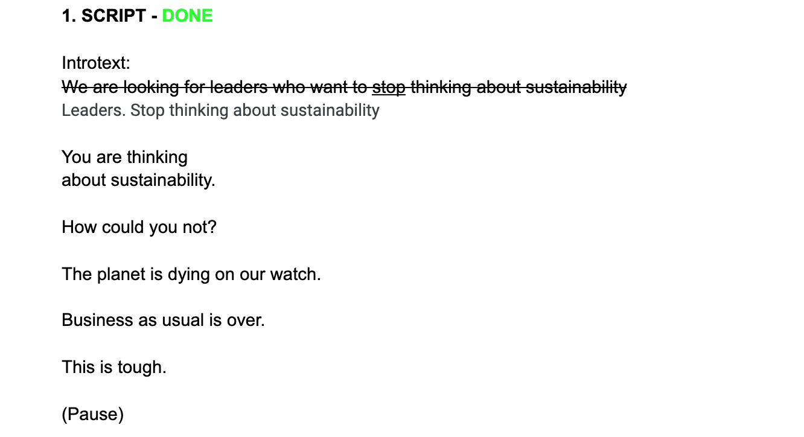
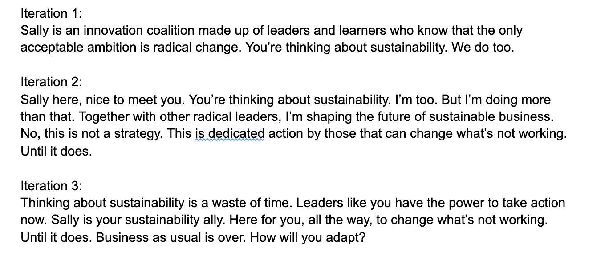
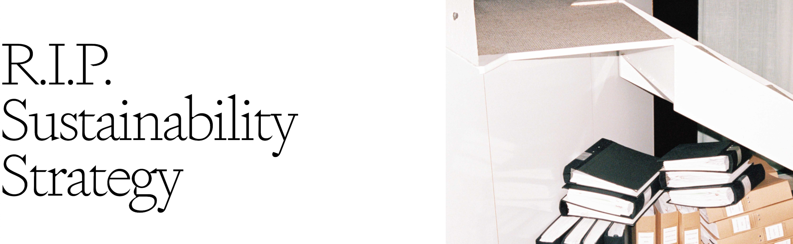
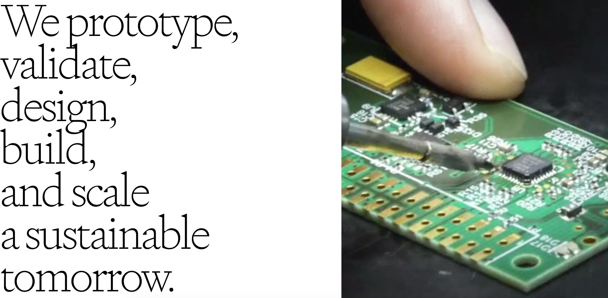

## From concept to final copy: SALLY

**Project:** I helped with the copywriting for SALLY, Doberman's new sustainability initiative. SALLY by Doberman and EY is an initiative to help bold brands become future-fit. I helped with copy for the website, sales, press and concepts.

**Challenge**: How do we show the world's top corporations that we're not just any consultancy while keeping our mission to the point? How do we spark action with every word?

**Audience**: Executives at large corporations globally.

**Medium:** Website + Presentations

**Process:** Brief > Workshop > 5 iterations > Testing > final copy

**Tonality drivers:** To the point, actionable, no bullsh*t.

[Visit SALLY](https://sally.doberman.co/)

## Sample concepts

## Final copy

