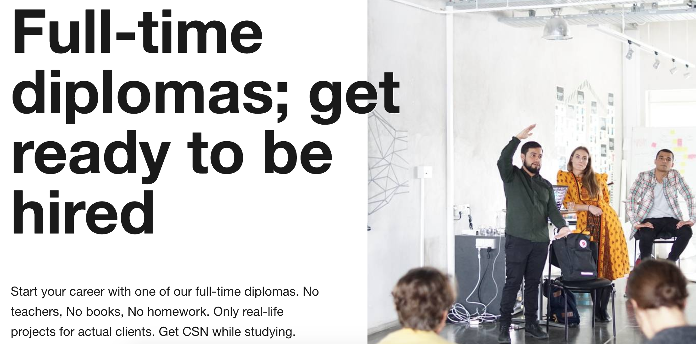
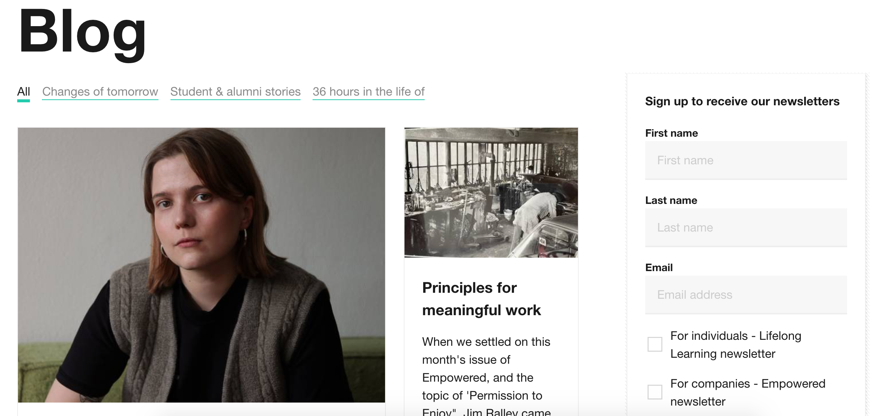

## At Hyper Island, I worked full-time as a Digital Marketer with a content focus for 1,5 years.

My focus at Hyper Island was to attract students to long-term programs. I conducted market research to ensure target audience needs were met with the offering and advertising.

**My role:** In-house Digital Content Marketer

**Engagement duration:** 2 years

**Project:** I developed a content strategy that was focused on engagement and a sense of community. I created an average of two articles a week, often based on interviews with students or collaborators. I was also responsible for email communication, paid media and ads, as well as website copy.

**Purpose:** Hyper Island is the leading school for digital business and design and has hubs in Stockholm, New York City, Singapore, Manchester, and Sao Paulo.

**Audience:** Freshly graduated students looking to get into the digital field (YH programs), anyone looking to build on their current career (Masters).

**Outcome:** Increased applications in the Recruitment team by 25% the first year, launched a new website with 18% increase in traffic.

| Text                                    | Image                                      |
| --------------------------------------- | ------------------------------------------ |
| I created content for the course pages. |  |

| Text                                               | Image                                      |
| -------------------------------------------------- | ------------------------------------------ |
| I wrote posts for the blog to support recruitment. |  |

**Examples of my content for Hyper Island:**\
\
— [The Reversed Mentorship Program](https://www.hyperisland.com/blog/the-reversed-mentorship-program-hyper-island-x-electrolux)\
\
— ["In Karlskrona, Hyper Island truly is your main focus."](https://www.hyperisland.com/community/news/in-karlskrona-hyper-island-is-truly-your-main-focus-and-i-found-that-beautiful)\
\
— [Hyper Island's Journey to the first ever Kids Summer Camp](https://www.hyperisland.com/community/news/hyper-island-and-the-journey-to-the-first-ever-kids-summer-camp)\
\
— [Why the part-time MA in Digital Management is a collaborative program](https://www.hyperisland.com/community/news/why-the-part-time-ma-in-digital-management-is-a-collaborative-program)\
\
— ["I've experienced so many great things here, I can't even remember them."](https://www.hyperisland.com/community/news/i-ve-experienced-so-many-great-things-here-i-can-t-even-remember-all-the-stuff-that-has-happened)\
\
— [A brief introduction to the Theory of Process Design and Facilitation](https://www.hyperisland.com/community/news/a-brief-introduction-to-the-theory-of-process-design-and-facilitation)\
\
— [The Hyper Island Way – Lead, collaborate, and develop](https://www.hyperisland.com/community/news/the-hyper-island-way-lead-collaborate-and-develop)\
\
— ["It's not a golden ticket, but it will help you get a foot in the door."](https://www.hyperisland.com/community/news/it-s-not-a-golden-ticket-but-it-will-help-you-get-a-foot-in-the-door?utm_campaign=SWE%20-%20Diploma%20-%20International%20students%20&utm_source=facebook&utm_medium=social)
