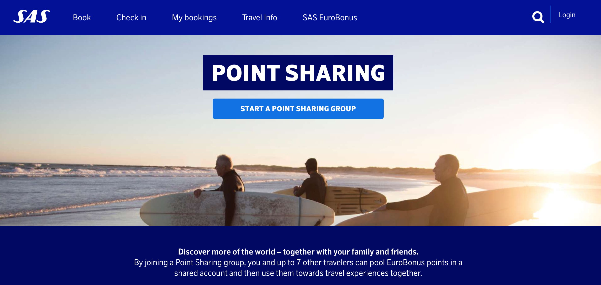
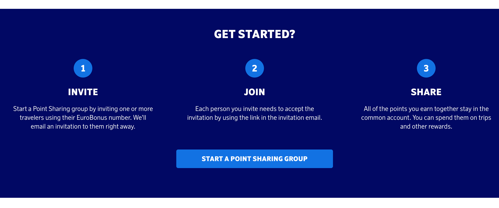
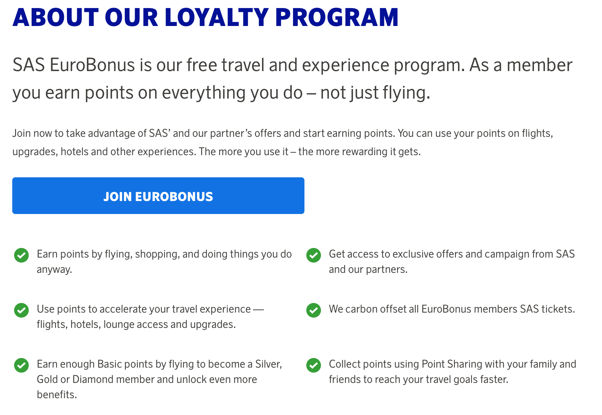

**Project:** I worked in a team of external and internal stakeholders as the only content specialist. I focused on developing UX copy and optimizing content in line with user data to increase user experience and relevancy. We launched both new Eurobonus services as well as updated existing services to make them more modern and accessible.

**Scope:** SAS Eurobonus services

**Medium:** Web + Mobile + Messaging

**Audience:** Frequent flyers, as well as those new to points for flying.

**Challenge:** How do we carry the SAS brand while also making Eurobonus more accessible for an audience that isn't frequent flyers or used to collecting points.

**Outcomes:** Reduced FAQ tickets by 30%, increased engagement with the service by 16%.

